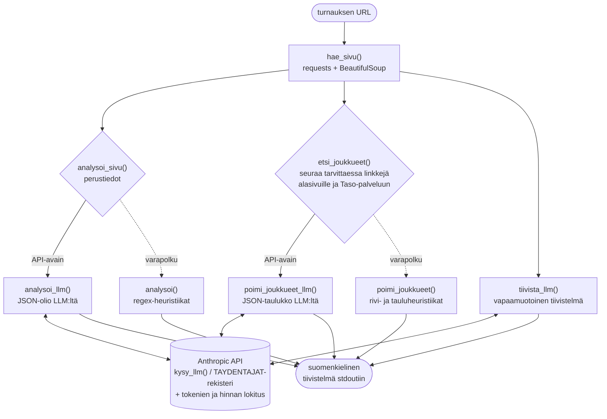

# Turnausluotain

[](https://github.com/timole/turnausluotain/actions/workflows/ci.yml)

Komentorivityökalu, joka lukee harrasteturnauksen www-sivun ja tuottaa siitä
suomenkielisen tiivistelmän: laji, ajankohta, paikkakunta, sarjat,
ilmoittautumistiedot ja ilmoittautuneet joukkueet.

```bash
$ python turnausluotain.py https://www.woudit.fi/etusivu/saimaa-turnaus/
TURNAUS: Linnan Woudit - Saimaa turnaus 2026
Laji:        jääkiekko
Ajankohta:   30.7 – 02.08.2026
Paikkakunta: Savonlinna, Rantasalmi
Sarjat:
  - 35+ ... 70+, naisten avoin sarja
Ilmoittautuminen:
  Turnauspäällikkö ..., turnausmaksu 680 euroa
Ilmoittautuneet joukkueet (70):
  - Hiki-Hockey Seniors (60+)
  - ...
LLM-tiivistelmä (claude-haiku-4-5):
  Savonlinnassa pelattava senioreiden jääkiekkoturnaus ...
```

Tiedonpoiminta tehdään ensisijaisesti LLM:llä (Anthropicin Claude), joten
luotain yleistyy erilaisiin turnaussivuihin ilman sivukohtaisia sääntöjä.
Joukkuelistaa etsitään tarvittaessa alasivuilta ja ulkoisista palveluista
(esim. Palloliiton Taso) linkkejä seuraamalla. Ilman API-avainta työkalu
toimii suppeammilla heuristiikoilla.

## Asennus

Vaatii Python 3.14:n.

```bash
git clone <repo-url> && cd turnausluotain
python3 -m venv .venv
.venv/bin/pip install -r requirements.txt
cp .env.example .env   # täytä ANTHROPIC_API_KEY
```

## Käyttö

```bash
.venv/bin/python turnausluotain.py <turnauksen-url>
.venv/bin/python turnausluotain.py --model claude-opus-4-8 <turnauksen-url>
```

Tiivistelmä tulostuu stdoutiin. Stderriin lokitetaan ajon kulku: sivuhaut,
LLM-kutsut kestoineen sekä tokenien kulutus ja hinta-arvio dollareina.
Pelkän tiivistelmän saa ohjaamalla lokin pois: `2>/dev/null`.

Kokonaiset näyttöajot tulosteineen ja lokeineen:

- [examples/woudit-saimaa-turnaus.txt](examples/woudit-saimaa-turnaus.txt) –
  seurajärjestäjän sivu, joukkueet Otteluohjelma-alasivulta
- [examples/palloliitto-kki-lopputurnaukset.txt](examples/palloliitto-kki-lopputurnaukset.txt) –
  liiton turnaussarja, joukkueet ulkoisesta Taso-palvelusta

## Arkkitehtuuri

Kaikki poimintapolut kulkevat samaa reittiä: LLM ensin, heuristiikat
varapolkuna ilman API-avainta tai LLM:n epäonnistuessa.



## Konfiguraatio

Asetukset luetaan `.env`-tiedostosta (pohja: `.env.example`); shell-ympäristön
muuttujat voittavat `.env`:n.

| Muuttuja | Merkitys | Oletus |
|---|---|---|
| `ANTHROPIC_API_KEY` | Anthropic API -avain. Ilman avainta poiminta tehdään heuristiikoilla eikä LLM-tiivistelmää tuoteta. | – |
| `TURNAUSLUOTAIN_MODEL` | LLM-malli (esim. `claude-opus-4-8`). Komentorivin `--model` voittaa tämän. | `claude-haiku-4-5` |
| `TURNAUSLUOTAIN_PROVIDER` | LLM-tarjoaja. Toistaiseksi vain `anthropic`; rajapinta tukee uusien tarjoajien (esim. paikallinen Ollama) lisäämistä `TAYDENTAJAT`-rekisteriin. | `anthropic` |

Ajo Haikulla maksaa tyypillisesti noin 1–2 senttiä per turnaussivu
(2 sivuhakua, 4 LLM-kutsua).

## Testit

BDD-tyyliset testit (Given/When/Then docstringeissä) hakevat oikeat sivut
verkosta, joten ne vaativat verkkoyhteyden.

```bash
.venv/bin/python -m pytest -v              # kaikki testit
.venv/bin/python -m pytest -m "not llm"    # ilman API-kutsuja (nopea, ilmainen)
```

`llm`-markerilla merkityt testit kutsuvat Anthropic-API:a ja ohitetaan
automaattisesti ilman avainta. Muut testit ajetaan aina ilman avainta,
joten heuristinen varapolku pysyy testattuna.

GitHub Actions ajaa jokaisella pushilla ja pull requestilla komennon
`pytest -m "not llm"`, eli CI:ssä ei kuluteta API-kutsuja.

## Rajoitukset

- JavaScript-renderöityjä sivuja ei tueta (vain palvelimen palauttama HTML).
- Heuristinen varapolku on viritetty tyypillisiä suomalaisia turnaussivuja
  vasten; LLM-polku on yleisluontoisempi.
- Puuttuva tieto raportoidaan arvolla "ei löytynyt sivulta", ei kaadeta ajoa.

Kehityskäytännöt ja arkkitehtuurin yksityiskohdat: ks. [CLAUDE.md](CLAUDE.md).
