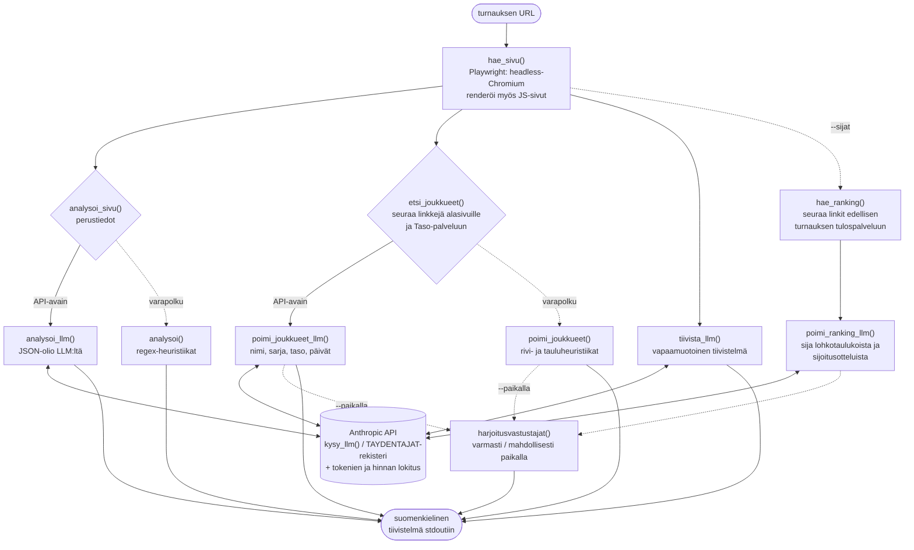

# Turnausluotain

[](https://github.com/timole/turnausluotain/actions/workflows/ci.yml)

Komentorivityökalu, joka lukee harrasteturnauksen www-sivun ja tuottaa siitä
suomenkielisen tiivistelmän: laji, ajankohta, paikkakunta, sarjat,
ilmoittautumistiedot ja ilmoittautuneet joukkueet.

```bash
$ python turnausluotain.py https://www.woudit.fi/etusivu/saimaa-turnaus/
TURNAUS: Linnan Woudit - Saimaa turnaus 2026
Laji:        jääkiekko
Ajankohta:   30.7 – 02.08.2026
Paikkakunta: Savonlinna, Rantasalmi
Sarjat:
  - 35+ ... 70+, naisten avoin sarja
Ilmoittautuminen:
  Turnauspäällikkö ..., turnausmaksu 680 euroa
Ilmoittautuneet joukkueet (70):
  - Hiki-Hockey Seniors (60+)
  - ...
LLM-tiivistelmä (claude-haiku-4-5):
  Savonlinnassa pelattava senioreiden jääkiekkoturnaus ...
```

Tiedonpoiminta tehdään ensisijaisesti LLM:llä (Anthropicin Claude), joten
luotain yleistyy erilaisiin turnaussivuihin ilman sivukohtaisia sääntöjä.
Sivut haetaan selaimella (Playwright), joten myös JavaScriptillä rakennetut
tulospalvelut luetaan. Joukkuelistaa etsitään tarvittaessa alasivuilta ja
ulkoisista palveluista (esim. Palloliiton Taso) linkkejä seuraamalla. Ilman
API-avainta työkalu toimii suppeammilla heuristiikoilla.

## Harjoitusottelun vastustajan etsintä

Turnaukseen saavutaan usein etuajassa, ja lämmittelyksi kaivataan
harjoitusottelua. Hyvä vastustaja on **paikalla oikeana päivänä** ja **samaa
tasoa**. Luotain vastaa molempiin:

```bash
.venv/bin/python turnausluotain.py --paikalla to --joukkue "Hiki-Hockey Seniors" \
    --sijat https://www.woudit.fi/etusivu/saimaa-turnaus/
```

```
HARJOITUSVASTUSTAJAT (paikalla to)
Oma joukkue: Hiki-Hockey Seniors (Tampere) (60+, A1, la-su)  [Miehet 60+ B 2.]

Varmasti paikalla (pelaa to): 25
  * KoPo 60 (Helsinki) (60+, B, to-pe)  [Miehet 60+ B 4.]
  * Hamarin Elohurtat (Porvoo) (60+, B, to-pe)
    Huru-Ukot (Vantaa) (50+, B1, to-pe)
    FIN Extremes (Helsinki) (70+, A, to-pe)
    ...

Mahdollisesti paikalla (pelaa vasta seuraavana päivänä): 21
    ...
```

- **Paikallaolo** luetaan otteluohjelman merkinnöistä (`to-pe`, `la-su`).
  Seuraavana päivänä pelaavat ovat *mahdollisesti* paikalla jo edellisiltana.
- **Taso** on järjestäjän oma tasoryhmä (`A1`/`A2`/`B`) — vertailukelpoinen
  vain sarjan sisällä, joten oma sarja merkitään `*`:llä.
- **`--sijat`** hakee oman sarjan parhausjärjestyksen edellisestä turnauksesta
  seuraamalla linkit tulospalveluun. Järjestys johdetaan sivun taulukoista ja
  sijoitusotteluista, ei arvata.

## Asennus

Vaatii Python 3.14:n.

```bash
git clone <repo-url> && cd turnausluotain
python3 -m venv .venv
.venv/bin/pip install -r requirements.txt
.venv/bin/python -m playwright install chromium
# Linuxilla lisäksi järjestelmäkirjastot:
sudo .venv/bin/python -m playwright install-deps chromium
cp .env.example .env   # täytä ANTHROPIC_API_KEY
```

## Käyttö

```bash
.venv/bin/python turnausluotain.py <turnauksen-url>
.venv/bin/python turnausluotain.py --model claude-opus-4-8 <turnauksen-url>
.venv/bin/python turnausluotain.py --paikalla to --joukkue NIMI --sijat <url>
```

Tiivistelmä tulostuu stdoutiin. Stderriin lokitetaan ajon kulku: sivuhaut,
LLM-kutsut kestoineen sekä tokenien kulutus ja hinta-arvio dollareina.
Pelkän tiivistelmän saa ohjaamalla lokin pois: `2>/dev/null`.

Kokonaiset näyttöajot tulosteineen ja lokeineen:

- [examples/harjoitusvastustajat-hhs.txt](examples/harjoitusvastustajat-hhs.txt) –
  harjoitusvastustajat torstaille ja oman sarjan sijat edellisvuodelta
- [examples/woudit-saimaa-turnaus.txt](examples/woudit-saimaa-turnaus.txt) –
  seurajärjestäjän sivu, joukkueet Otteluohjelma-alasivulta
- [examples/palloliitto-kki-lopputurnaukset.txt](examples/palloliitto-kki-lopputurnaukset.txt) –
  liiton turnaussarja, joukkueet ulkoisesta Taso-palvelusta

## Arkkitehtuuri

Kaikki poimintapolut kulkevat samaa reittiä: LLM ensin, heuristiikat
varapolkuna ilman API-avainta tai LLM:n epäonnistuessa.



## Konfiguraatio

Asetukset luetaan `.env`-tiedostosta (pohja: `.env.example`); shell-ympäristön
muuttujat voittavat `.env`:n.

| Muuttuja | Merkitys | Oletus |
|---|---|---|
| `ANTHROPIC_API_KEY` | Anthropic API -avain. Ilman avainta poiminta tehdään heuristiikoilla eikä LLM-tiivistelmää tuoteta. | – |
| `TURNAUSLUOTAIN_MODEL` | LLM-malli (esim. `claude-opus-4-8`). Komentorivin `--model` voittaa tämän. | `claude-haiku-4-5` |
| `TURNAUSLUOTAIN_PROVIDER` | LLM-tarjoaja. Toistaiseksi vain `anthropic`; rajapinta tukee uusien tarjoajien (esim. paikallinen Ollama) lisäämistä `TAYDENTAJAT`-rekisteriin. | `anthropic` |

Ajo Haikulla maksaa tyypillisesti noin 1–3 senttiä per turnaussivu
(2 sivuhakua, 4 LLM-kutsua); tarkat luvut näkyvät ajolokista.

## Testit

BDD-tyyliset testit (Given/When/Then docstringeissä) hakevat oikeat sivut
verkosta, joten ne vaativat verkkoyhteyden.

```bash
.venv/bin/python -m pytest -v              # kaikki testit
.venv/bin/python -m pytest -m "not llm"    # ilman API-kutsuja (nopea, ilmainen)
```

`llm`-markerilla merkityt testit kutsuvat Anthropic-API:a ja ohitetaan
automaattisesti ilman avainta. Muut testit ajetaan aina ilman avainta,
joten heuristinen varapolku pysyy testattuna.

GitHub Actions ajaa jokaisella pushilla ja pull requestilla komennon
`pytest -m "not llm"`, eli CI:ssä ei kuluteta API-kutsuja.

## Rajoitukset

- JavaScript-renderöityjä sivuja ei tueta (vain palvelimen palauttama HTML).
- Heuristinen varapolku on viritetty tyypillisiä suomalaisia turnaussivuja
  vasten; LLM-polku on yleisluontoisempi.
- Puuttuva tieto raportoidaan arvolla "ei löytynyt sivulta", ei kaadeta ajoa.

Kehityskäytännöt ja arkkitehtuurin yksityiskohdat: ks. [CLAUDE.md](CLAUDE.md).
